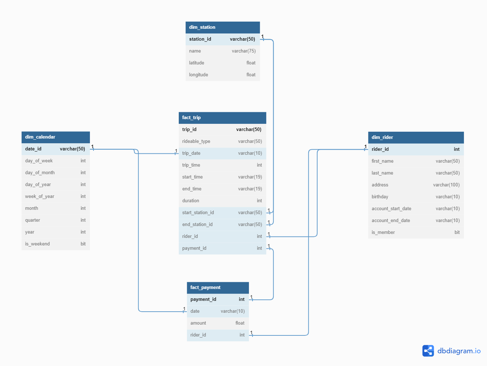

# Building an Azure Data Warehouse for Bike Share Data Analytics

## Project Overview
Divvy is a bike sharing program in Chicago, Illinois USA that allows riders to purchase a pass at a kiosk or use a mobile application to unlock a bike at stations around the city and use the bike for a specified amount of time. The bikes can be returned to the same station or to another station. The City of Chicago makes the anonymized bike trip data publicly available for projects like this where we can analyze the data.

### Business Requirements
1. Analyze the duration of each ride:
    - Based on date and time factors such as day of the week and time of day
    - Based on the starting and/or ending station
    - Based on the rider's age at the time of the ride
    - Based on whether the rider is a member or casual rider
2. Analyze the cost:
    - Per month, quarter, and year
    - Per member, based on the rider's age at account start
3. Analyze the cost per member:
    - Based on the number of rides the rider averages per month
    - Based on the number of minutes the rider spends on a bike per month

### Programming Language and Technologies
- Python
- PostgreSQL
- Azure Blob Storage (Azure Data Lake Storage Gen2)
- Azure Synapse Analytics
- Azure Synapse Serverless SQL Pool

## Directory Structre
This section outlines the directory structure of the data within the Azure Data Lake Storage Gen2. The data is divided into two layers: raw,and gold (curated business-level tables). 
```
bike_share_data/
        raw/
            payment.csv
            rider.csv
            station.csv
            trip.csv
        gold/
            dim_calendar
            dim_rider
            dim_station
            fact_calendar
            fact_payment
```


## STAR Schema Design



## Extract Step: Create the data in PostgreSQL
To store the bike share data in Azure Blob Storage &mdash; first, create tables in PostgreSQL using a Python script called [ProjectDataToPostgres.py](https://github.com/fabiansum/bike-share-analytics-data-warehouse/blob/main/ProjectDataToPostgres.py). The script converts raw CSV data into tables with relationships in a PostgreSQL database.

Next, create a linked service to the PostgreSQL server in Synapse Studio. Then, use the ingest wizard in Azure Synapse workspace to ingest data from PostgreSQL to Azure Blob Storage and create a one-time pipeline.


**Note:**
As there is no access to a Dedicated SQL pool &mdash; the calendar table is created using PostgreSQL, following a process similar to the creation of the other four tables. You can generate the calendar table separately using the provided python file [ProjectDataToPostgres_calendar.py](https://github.com/fabiansum/bike-share-analytics-data-warehouse/blob/main/ProjectDataToPostgres_calendar.py), or generate all tables together using the file [ProjectDataToPostgres_all.py](https://github.com/fabiansum/bike-share-analytics-data-warehouse/blob/main/ProjectDataToPostgres_all.py).


## Load Step: Create Staging Tables using CREATE EXTERNAL TABLE
Scripts 4 to 7 inside the `sql_scripts` folder are used to populate the staging tables with data from CSV files. Once the data is loaded with correct column data type, you can proceed to the transform step to transform the data into a format that is suitable for analysis.
- [Staging Payment Table](https://github.com/fabiansum/bike-share-analytics-data-warehouse/blob/sql_scripts/4_create_external_table_staging_payment.sql)
- [Staging Rider Table](https://github.com/fabiansum/bike-share-analytics-data-warehouse/blob/sql_scripts/5_create_external_table_staging_rider.sql)
- [Staging Station Table](https://github.com/fabiansum/bike-share-analytics-data-warehouse/blob/sql_scripts/6_create_external_table_staging_station.sql)
- [Staging Trip Table](https://github.com/fabiansum/bike-share-analytics-data-warehouse/blob/sql_scripts/7_create_external_table_staging_trip.sql)


## Transform Step: Create Fact and Dimension Tables using CETAS
Scripts 10 to 14 in the `sql_scripts` folder are used to create fact and dimension tables using CETAS. These tables are created based on the business requirements listed in the project overview, using the staging table as a source.
- [Fact Payment Table](https://github.com/fabiansum/bike-share-analytics-data-warehouse/blob/sql_scripts/10_create_fact_payment.sql)
- [Dimension Rider Table](https://github.com/fabiansum/bike-share-analytics-data-warehouse/blob/sql_scripts/11_create_dim_rider.sql)
- [Dimension Station Table](https://github.com/fabiansum/bike-share-analytics-data-warehouse/blob/sql_scripts/12_create_dim_station.sql)
- [Fact Trip Table](https://github.com/fabiansum/bike-share-analytics-data-warehouse/blob/sql_scripts/13_create_fact_trip.sql)


